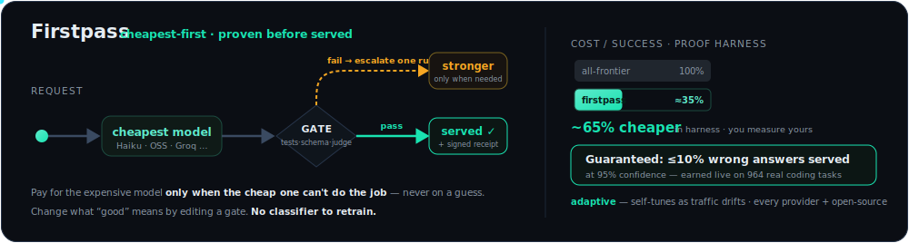
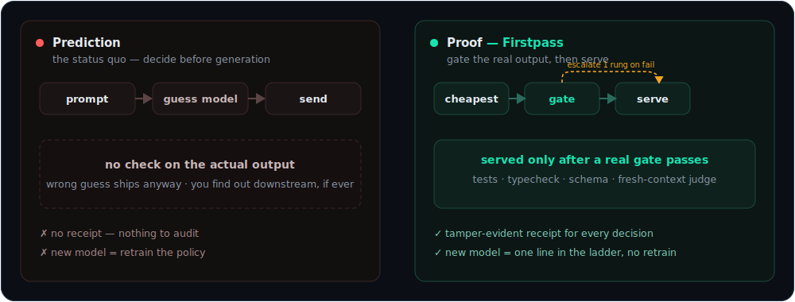
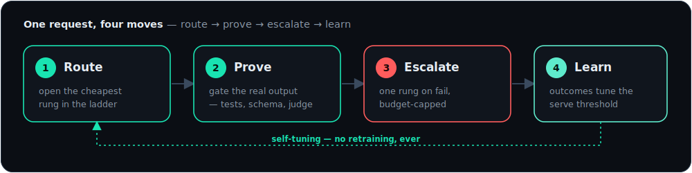
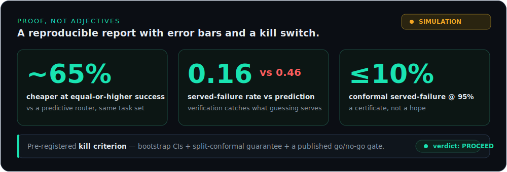

<div align="center">



# Firstpass

**Route every LLM request to the cheapest model that _provably_ passes your quality gate — and get a signed receipt for the decision.**

Proof over prediction. Built for agent fleets.

[](https://github.com/dshakes/firstpass/actions/workflows/ci.yml)
[](LICENSE)
[](SPEC.md)
[](https://dshakes.github.io/firstpass)

**[Website](https://dshakes.github.io/firstpass)** · [Quickstart](#quickstart) · [Install](#install) · [How it works](#how-it-works) · [Configure](#configuration) · [SPEC](SPEC.md)

</div>

---

Firstpass is a **drop-in, Anthropic-compatible proxy**. Point your agent's `base_url` at it and every request is routed to the cheapest model first, its **real output** is checked by a gate you define (tests, typecheck, schema, a judge), and it escalates one rung only when the gate fails — writing a tamper-evident audit trace for every decision.

> **Honestly scoped.** The proxy routes, gates, escalates, fails over, audits, and learns end-to-end over real HTTP — no test doubles in the plane, and the enforce path is [live-verified](#proof-not-adjectives) against real Anthropic. The [proof harness](#proof-not-adjectives) has a **200-task live result** and an **earned distribution-free served-failure bound on real MBPP** below; still ahead: a 30-day dogfood and the hosted control plane. See the [roadmap](#roadmap). Nothing here is claimed as measured that isn't.

## Quickstart

See the whole loop in ~10 seconds — **no API keys**:

```bash
git clone https://github.com/dshakes/firstpass && cd firstpass
cargo run -p firstpass-proxy --example demo
```

It stands up a mock upstream and the proxy, drives one real decision (cheap model fails the gate → escalates → passes), prints the [receipt](#the-receipt), submits feedback, and re-verifies the sealed chain.

**Then use it in front of your own agent:**

```bash
firstpass-proxy                                    # 1. run it (observe mode: logs, changes nothing)
export ANTHROPIC_BASE_URL="http://127.0.0.1:8080"  # 2. point your agent at it — same wire format
#   … use your agent normally; Firstpass records a receipt per call …
unset ANTHROPIC_BASE_URL                            # 3. offboard anytime — one env var
```

To turn on cheapest-first routing + gating, copy [`firstpass.example.toml`](firstpass.example.toml) and run in enforce mode — see [Configuration](#configuration).

## Install

**Works today** (no release required):

| Method | Command |
| --- | --- |
| **From source** | `cargo install --git https://github.com/dshakes/firstpass firstpass-proxy` |
| **Docker** | `docker run -p 8080:8080 -e FIRSTPASS_BIND=0.0.0.0:8080 ghcr.io/dshakes/firstpass:latest` |

**Lit up by the first tagged release** — every format below is wired end-to-end (verified locally) and attaches to the [GitHub Release](https://github.com/dshakes/firstpass/releases) / its registry the moment a `v*` tag is pushed:

| Method | Command |
| --- | --- |
| **pip** | `pip install firstpass` |
| **uvx** | `uvx firstpass` |
| **Homebrew** | `brew install dshakes/tap/firstpass` |
| **npm** | `npx @dshakesnotbot/firstpass` |
| **curl \| sh** | `curl --proto '=https' --tlsv1.2 -LsSf https://github.com/dshakes/firstpass/releases/latest/download/firstpass-proxy-installer.sh \| sh` |
| **PowerShell** | `irm https://github.com/dshakes/firstpass/releases/latest/download/firstpass-proxy-installer.ps1 \| iex` |
| **crates.io** | `cargo install firstpass-proxy` |
| **Prebuilt binary** | macOS · Linux · Windows, all checksummed, from the Release page |

> Prebuilt binaries and the `curl \| sh` / PowerShell installers are produced by [cargo-dist](https://opensource.axo.dev/cargo-dist/); the pip/uvx wheels by [maturin](https://www.maturin.rs/) (the same model `ruff` and `uv` ship with). The container image publishes to [GHCR](https://github.com/dshakes/firstpass/pkgs/container/firstpass) on every push to `main`. **Publishing gates that need an operator secret (not code):** a Homebrew **tap repo + `HOMEBREW_TAP_TOKEN`**, an **`NPM_TOKEN`**, a **`PYPI_API_TOKEN`**, and a **crates.io token** — until each is set, that channel's build still runs but skips the registry push. See [`docs/runbooks/release.md`](docs/runbooks/release.md).

### Upgrade

Binaries from `curl | sh` / PowerShell ship a self-updater (via cargo-dist):

```bash
firstpass-proxy-update      # pulls the latest release in place
```

Or upgrade through whichever channel you installed from:

| Installed via | Upgrade |
| --- | --- |
| Homebrew | `brew upgrade firstpass` |
| pip / uvx | `pip install -U firstpass` · `uvx firstpass@latest` |
| npm | `npm update -g @dshakesnotbot/firstpass` |
| crates.io | `cargo install firstpass-proxy` (reinstalls latest) |
| Docker | `docker pull ghcr.io/dshakes/firstpass:latest` |

## Prediction vs. proof

<div align="center"></div>

Model routers on the market route by **prediction** — a learned policy guesses which model will answer well, sends the request there, and never checks. Firstpass routes by **proof**: it runs a real gate on the real output, and the decision is a record you can audit — not a guess you hope was right.

## How it works

<div align="center"></div>

1. **Route** to the cheapest rung of a declarative ladder. BYOK — your keys pass through, redacted from every log.
2. **Gate** the real output: inline (non-empty, JSON, [JSON-Schema](SPEC.md)) or subprocess plugins (your tests/linter/judge) that read the candidate on **stdin, never argv** — injection-resistant. Per-gate error budgets auto-disable a flaky gate.
3. **Escalate** exactly one rung on gate failure — budget-capped; a provider 5xx fails over cross-provider. Serve the first output that passes, and record everything.

## The receipt

Not a dashboard number — a decision you can audit. Every call becomes a hash-chained JSON trace an external auditor can re-derive.

<div align="center"></div>

```jsonc
{
  "trace_id": "0192f3a1-7c4e-7abc-9d21-4e8b1f0a2c33",
  "prev_hash": "9f2c…a1b7",                         // chains to the previous decision — tamper-evident
  "mode": "enforce",
  "attempts": [
    { "rung": 0, "model": "anthropic/claude-haiku-4-5", "cost_usd": 0.0007,
      "gates": [{ "gate_id": "cargo-test", "verdict": "fail", "score": 0.0 }],
      "verdict": "fail" },                           // cheap model tried first — the test gate caught it
    { "rung": 1, "model": "anthropic/claude-sonnet-5", "cost_usd": 0.0121,
      "gates": [{ "gate_id": "cargo-test", "verdict": "pass", "score": 1.0 }],
      "verdict": "pass" }                            // escalated one rung, proven to pass, served
  ],
  "final": { "served_rung": 1, "total_cost_usd": 0.0128,
             "counterfactual_baseline_usd": 0.0630, "savings_usd": 0.0502 }
}
```

Point at any request and answer *why did this go to that model, and what did it cost* — and re-derive the hash chain yourself. Downstream outcomes flow back via [`POST /v1/feedback`](SPEC.md) onto a deferred-verdict side table that never alters the sealed record.

## Configuration

Firstpass is configured through the environment (12-factor) — run `firstpass-proxy --help` for the full reference:

| Variable | Purpose | Default |
| --- | --- | --- |
| `FIRSTPASS_MODE` | `observe` \| `enforce` | `observe` |
| `FIRSTPASS_BIND` | listen address | `127.0.0.1:8080` |
| `FIRSTPASS_CONFIG` | path to `firstpass.toml` (routes, ladders, gates) | — |
| `FIRSTPASS_DB` | trace store path | `firstpass.db` |
| `FIRSTPASS_UPSTREAM_ANTHROPIC` | upstream base URL | `https://api.anthropic.com` |
| `FIRSTPASS_UPSTREAM_OPENAI` | upstream base URL | `https://api.openai.com` |

Routing itself is declarative TOML — routes → mode, a cheapest-first model ladder, and the gates that must pass. Start from [`firstpass.example.toml`](firstpass.example.toml):

```bash
cp firstpass.example.toml firstpass.toml
FIRSTPASS_MODE=enforce FIRSTPASS_CONFIG=./firstpass.toml firstpass-proxy
```

**Any provider, including open-source models.** `anthropic` and `openai` are built in; a `[[provider]]` entry adds any other. Because the OpenAI Chat Completions API is the de-facto standard, one entry covers Groq, Together, Fireworks, DeepSeek, Mistral, xAI, OpenRouter, Azure — or a local **Ollama / vLLM** server running open-source Llama / Qwen / DeepSeek weights. A ladder rung is then `<id>/<model>`, so a route can open on a cheap open-source rung and escalate to a frontier model only when the gate fails:

```toml
[[provider]]
id = "groq"
dialect = "openai"
base_url = "https://api.groq.com/openai"
api_key_env = "GROQ_API_KEY"

[[route]]
match = {}
mode = "enforce"
ladder = ["groq/llama-3.3-70b-versatile", "anthropic/claude-sonnet-5"]
gates = ["unit-tests"]
```

**Endpoints:** `POST /v1/messages` (drop-in) · `POST /v1/feedback` · `GET /v1/capabilities` · `GET /healthz`.

## Proof, not adjectives

<div align="center"></div>

The harness (`cargo run -p firstpass-bench`) runs the full methodology — baselines, bootstrap confidence intervals, a split-conformal served-failure guarantee, and a **pre-registered kill criterion** that says *stop* if the thesis fails — behind real-backend trait seams. `--live` swaps the simulated backend for real providers (BYOK).

**Live — real Anthropic, 200 graded verifiable tasks** (`--live`, difficulty-graded arithmetic; reproducible, deterministic):

| policy | success | $/success | served-failure |
|---|---|---|---|
| always-cheap (Haiku) | 0.62 `[0.55, 0.69]` | $0.0001 | 0.38 |
| always-top (Opus) | 0.98 `[0.96, 0.99]` | $0.0023 | 0.02 |
| predictive router | 0.88 | $0.0007 | 0.12 |
| **firstpass** | **1.00** `[1.00, 1.00]` | **$0.0003** | **0.00** |

Firstpass served at **~85% lower $/success than always-top, at parity-or-better quality**, with **served-failure 0.00 vs the predictive router's 0.12** — verification catches what prediction serves blind. The cheap tier cleared 62% of tasks against a 13% break-even, so **the pre-registered kill criterion reads PROCEED**.

**Reproduced with a real LLM-judge gate, not just a deterministic checker** (`FIRSTPASS_GATE=judge`, Sonnet grading each answer *without seeing the ground truth*, n=200): firstpass **1.00 success, ~84% cheaper than Opus, served-failure 0.00, PROCEED** — the win holds with the gate you'd actually deploy.

On self-checking arithmetic the **conformal served-failure guarantee is degenerate** — the gate is near-perfect, so there's nothing to bound. Earning the guarantee needs a domain where the *best practical* gate is still imperfect: a **coding-with-tests benchmark**, where real test suites have coverage gaps. That's now built (a fail-closed sandbox for untrusted code — [ADR 0002](docs/adr/0002-bench-code-execution-sandbox.md), gVisor `runsc` first, `--network none`, capability drops, no host mounts — and a continuous gate score) **and run live**:

**Live — real MBPP, real models (the imperfect-gate domain the guarantee needs):** a Haiku candidate writes code for **964 MBPP test-split tasks**; each solution runs against its visible tests (the gate) and a held-out hidden oracle (ground truth) in the fail-closed sandbox.

| metric | value |
|---|---|
| gate false-accept rate | **14.5%** — passes every visible test, fails the hidden oracle (the coverage-gap error arithmetic can't produce) |
| served-failure if you ship on "tests pass" | 4.1% — ~1 in 24 "passing" answers is wrong |
| **conformal bound (threshold 0.50)** | **≤10% served-failure at 95% confidence** — distribution-free, empirically 7.6%, while **serving 82%** of requests |
| **+ self-consistency LLM-judge on the gate** | same 82% coverage, same ≤10% certified bound, empirical served-failure **7.6% → 5.9%** — the judge catches full-pass false-accepts the tests miss |

This is the guarantee arithmetic could not earn: a **mathematical, distribution-free bound on how often a wrong answer reaches you**, on a standard public benchmark — something no predictive router, gateway, or orchestrator offers. Add a calibrated judge to the gate and the *actual* error tightens further at no cost to coverage.

## Roadmap

- **M0 ✓** — proof harness: baselines, bootstrap CIs, conformal guarantee, pre-registered kill criterion.
- **M1 ✓** — Rust proxy: Anthropic + OpenAI clients, observe **and** enforce, escalation, cross-provider failover, SQLite trace store — over real HTTP.
- **M2 ✓** — gate framework: subprocess plugins, inline + schema gates, **native LLM-judge gate** (maker≠checker, candidate-as-data), error-budget auto-disable, feedback API + deferred verdicts.
- **M2.5 ✓** — real-traffic proxy: **SSE streaming passthrough**, tool/multimodal-safe enforce; **`firstpass` CLI** (`up` / `doctor` / `trace`) + **MCP server**; live-provider proof harness (`--live`).
- **M3 ✓** — 200-task live benchmark (cost/success proof at scale) **and** a real LLM-judge gate reproduction — both done against real Anthropic. Only **published binaries + a Homebrew tap** remain from this milestone (the cargo-dist `release.yml` has never been run — see [`docs/runbooks/release.md`](docs/runbooks/release.md)).
- **Speculative escalation ✓** — cheap and next-rung run in parallel for latency, serving a byte-identical result to sequential escalation.
- **Sandbox + coding-with-tests conformal ✓** — fail-closed sandbox + continuous-gate benchmark (ADR 0002), **run live on 964 MBPP tasks: a feasible distribution-free ≤10%@95% served-failure bound** (the guarantee arithmetic couldn't earn).
- **Learning loop ✓** — `firstpass calibrate` recalibrates the serving threshold from real deferred feedback; conformal moved to `firstpass-core` so proxy and bench share it.
- **Prod hardening ✓** — HTTP client timeouts, a bounded trace channel with load-shedding, opaque error responses, an explicit request-body cap, sandbox shell-quoting; see [ADR 0003](docs/adr/0003-production-ga-readiness.md) for the full GA-readiness gap analysis.
- **Not yet done** — published binaries + Homebrew tap, an external security audit, SOC 2 (see [`docs/compliance/soc2-controls.md`](docs/compliance/soc2-controls.md) for the readiness map, not a claim), a hosted multi-tenant plane, and a real 30-day soak (procedure in [`docs/runbooks/soak.md`](docs/runbooks/soak.md); hasn't been run and closed out).
- **Hosted GA →** — multi-tenant control plane, BYOK KMS envelope encryption, sandboxed gate execution — designed in [ADR 0001](docs/adr/0001-hosted-ga-architecture.md), gated behind dogfood GA.

## Links

[Website](https://dshakes.github.io/firstpass) · [SPEC](SPEC.md) · [Example config](firstpass.example.toml) · [Agent guide](AGENTS.md) · [llms.txt](llms.txt) · [License](LICENSE)

<div align="center"><sub>Proof over prediction. No competitor products named — Firstpass competes on evidence, not adjectives.</sub></div>
