<div align="center">

# ⚡ Firstpass

### Cheap-model prices. Frontier-model reliability. Mathematically guaranteed.

The adaptive LLM router that **proves every answer before serving it** — so the cheapest model that can do the job is the one you pay for.

[](https://github.com/dshakes/firstpass/actions/workflows/ci.yml)
[](https://crates.io/crates/firstpass-proxy)
[](https://pypi.org/project/firstpass/)
[](LICENSE)

**[Website](https://dshakes.github.io/firstpass)** · [Install](#install) · [Quickstart](#quickstart) · [How it works](#how-it-works) · [Benchmarks](#benchmarks) · [Docs](https://dshakes.github.io/firstpass/usage.html)



</div>

## Highlights

- 💸 **Cheapest model first, always** — you pay frontier prices only when a real check proves you must.
- 🛡️ **A guarantee, not a vibe** — ≤10% wrong answers served at 95% confidence, earned live on 964 real coding tasks.
- 🧠 **Self-tuning** — the serve threshold recalibrates from live outcomes as your traffic drifts. No retraining, ever.
- 🔍 **Proof, not prediction** — the gate checks the *actual output*; a wrong answer is caught, never shipped on a guess.
- 🧾 **A receipt per decision** — hash-chained, tamper-evident, auditable: *why this model, what did it cost, what did it save*.
- 🌐 **Every provider** — Anthropic, OpenAI, Gemini, Bedrock, Vertex, Groq, DeepSeek, OpenRouter, Azure, local Ollama/vLLM.
- 🪶 **Drop-in, walk-out** — one env var in, one env var out. Speaks the wire format your agent already uses.

## Install

No Rust, no toolchain — grab a binary and go:

```bash
curl --proto '=https' --tlsv1.2 -LsSf https://github.com/dshakes/firstpass/releases/latest/download/firstpass-proxy-installer.sh | sh
```

Or through your package manager — every channel publishes automatically on each release:

| | |
|---|---|
| 🐍 **pip / uvx** | `pip install firstpass` · `uvx --from firstpass firstpass-proxy` |
| 🍺 **Homebrew** | `brew install dshakes/tap/firstpass` |
| 📦 **npm** | `npx @dshakesnotbot/firstpass` |
| 🐳 **Docker** | `docker run -p 8080:8080 -e FIRSTPASS_BIND=0.0.0.0:8080 ghcr.io/dshakes/firstpass:latest` |
| 🦀 **Cargo** | `cargo install firstpass-proxy` |
| ⬇️ **Binaries** | macOS · Linux · Windows, checksummed, self-updating (`firstpass-proxy-update`) — [Releases](https://github.com/dshakes/firstpass/releases) |

## Quickstart

Three lines. Zero config. Zero risk — observe mode changes nothing:

```bash
firstpass-proxy                                     # watches your traffic, touches nothing
export ANTHROPIC_BASE_URL="http://127.0.0.1:8080"   # your agent now routes through firstpass
# … use your agent normally — every call gets a receipt: what it'd route, what you'd save
```

Convinced by your own numbers? Switch on routing:

```bash
cp firstpass.example.toml firstpass.toml
FIRSTPASS_MODE=enforce FIRSTPASS_CONFIG=./firstpass.toml firstpass-proxy
```

Leaving is `unset ANTHROPIC_BASE_URL`. That's the whole offboarding story.

## 🤖 Agentic onboarding — one command does everything

Don't follow docs. Firstpass detects your machine, plans the setup, executes it, and verifies itself:

```console
$ firstpass onboard --apply
detected: shell=zsh · proxy_running=false · routed=false · claude_cli=true

✓ proxy started (pid 17005, observe mode) — log: firstpass-proxy.log
✓ wired ~/.zshrc — export ANTHROPIC_BASE_URL=http://127.0.0.1:8080
→ optional: claude mcp add firstpass -- firstpass mcp
✓ verified — proxy healthy · capabilities live
```

It auto-detects your shell (zsh/bash/fish), whether the proxy is running, whether you're already routed, and which agents you have — then does only what's missing. **Idempotent** (re-run any time), **transparent** (`firstpass onboard` alone is a dry run showing the exact plan), and **reversible**: `firstpass offboard` strips the shell line, stops the proxy, and prints the unset — the whole exit in one command.

For agents onboarding *themselves*: [`llms.txt`](llms.txt) + [`AGENTS.md`](AGENTS.md) ship machine-readable setup, `GET /v1/capabilities` gives runtime discovery, and `firstpass mcp` exposes traces and savings as tools.

## Benchmarks

<div align="center"></div>

And the claim no other router makes: on **964 real MBPP coding tasks** (fail-closed sandbox, real test gates), firstpass earned a **distribution-free bound of ≤10% wrong answers served at 95% confidence** — empirically 7.6%, tightening to 5.9% with an LLM judge on the gate, while serving 82% of requests from the cheap tier. Your savings depend on your workload — which is why every trace records the always-top counterfactual, **so you measure your number instead of trusting ours.** Reproduce everything: `cargo run -p firstpass-bench` ([methodology](https://dshakes.github.io/firstpass/#proof), pre-registered kill criterion included).

## How it works

<div align="center"></div>

1. **Route** — every request opens on the cheapest rung of your model ladder.
2. **Prove** — a *gate* checks the actual output: your unit tests, a JSON schema, or an LLM judge (maker ≠ checker).
3. **Escalate** — only on gate failure: one rung up, budget-capped, cross-provider failover on a 5xx.
4. **Learn** — outcomes feed back; the serve threshold self-tunes so the guarantee tracks your live traffic.

> **Who decides a request needs the expensive model?** The gate — from the cheap model's *actual answer*. Never a classifier guessing from the prompt. Change what "good" means by editing a gate; there is no policy model to retrain.

## "Do I have to write gates?"

No. Meet it where you are:

| Effort | You get |
|---|---|
| **None** — observe mode | Firstpass reports what it *would* route and save. Nothing changes. |
| **One sentence** — judge gate | A second model grades every answer against your plain-English rubric. |
| **Your existing tests** | The strongest gate: generated code ships only if your suite actually passes. |

Flaky gates auto-disable on an error budget — one bad check can't take down a route.

## Every provider, including open-source

A ladder rung is `<id>/<model>` — open on a free local model, escalate to a frontier model only on proven need:

```toml
[[provider]]
id = "groq"                                  # any OpenAI-compatible host — Groq, Together,
dialect = "openai"                           # DeepSeek, Mistral, xAI, OpenRouter, Azure —
base_url = "https://api.groq.com/openai"     # or your own Ollama / vLLM box
api_key_env = "GROQ_API_KEY"

[[route]]
match  = {}
mode   = "enforce"
ladder = ["groq/llama-3.3-70b-versatile", "anthropic/claude-sonnet-5"]
gates  = ["unit-tests"]
```

`anthropic` and `openai` are built in; Gemini (`dialect = "gemini"`), AWS Bedrock (`auth = "aws_sigv4"`), and Google Vertex (`auth = "gcp_oauth"`) use the same shape. Every variant ships in [`firstpass.example.toml`](firstpass.example.toml), guarded by a parse test — full walkthrough on the [usage page](https://dshakes.github.io/firstpass/usage.html#providers).

<details>
<summary><b>🧾 The receipt</b> — every decision is a hash-chained trace an auditor can re-derive</summary>

```jsonc
{
  "trace_id": "0192f3a1-7c4e-7abc-9d21-4e8b1f0a2c33",
  "prev_hash": "9f2c…a1b7",                          // chains to the prior decision — tamper-evident
  "attempts": [
    { "rung": 0, "model": "anthropic/claude-haiku-4-5", "cost_usd": 0.0007,
      "gates": [{ "gate_id": "cargo-test", "verdict": "fail" }] },   // cheap tried first — gate caught it
    { "rung": 1, "model": "anthropic/claude-sonnet-5", "cost_usd": 0.0121,
      "gates": [{ "gate_id": "cargo-test", "verdict": "pass" }] }    // escalated, proven, served
  ],
  "final": { "served_rung": 1, "total_cost_usd": 0.0128,
             "counterfactual_baseline_usd": 0.0630, "savings_usd": 0.0502 }
}
```

Downstream outcomes flow back via `POST /v1/feedback` onto a deferred-verdict side table that never alters the sealed record.
</details>

<details>
<summary><b>⚙️ Configuration</b> — 12-factor, env-driven</summary>

| Variable | Purpose | Default |
|---|---|---|
| `FIRSTPASS_MODE` | `observe` \| `enforce` | `observe` |
| `FIRSTPASS_BIND` | listen address | `127.0.0.1:8080` |
| `FIRSTPASS_CONFIG` | path to `firstpass.toml` (routes, ladders, gates, providers) | — |
| `FIRSTPASS_DB` | trace store path | `firstpass.db` |

**Endpoints:** `POST /v1/messages` (drop-in) · `POST /v1/feedback` · `GET /v1/capabilities` · `GET /healthz` · `GET /metrics`.

Multi-tenant deployments add per-tenant auth (Argon2id), rate limits, gate-health scoping, and AES-256-GCM key custody — all opt-in, default-off ([ADR 0004](docs/adr/0004-hosted-multitenant-plane.md)).
</details>

## Firstpass vs. predictive routers

| | Predictive routers | ⚡ **Firstpass** |
|---|---|---|
| Decides by | guessing from the prompt | **proving the real output** |
| A wrong answer | ships silently | **caught by the gate, escalated** |
| Quality guarantee | none | **≤10% served-failure @ 95%, earned live** |
| Adapts by | retraining a policy model | **self-tuning threshold + edit a gate** |
| Audit trail | a dashboard number | **hash-chained receipt per decision** |

## Status

**v0.1.6 — GA-ready core, shipped in the open.** Enforce + observe over real HTTP, cross-provider failover, LLM-judge gates, speculative escalation (~2× p95), the earned conformal guarantee, self-tuning threshold, tool/multimodal/streaming enforce, every provider, every install channel auto-published. Tracked honestly on the [roadmap](https://dshakes.github.io/firstpass/#roadmap): 30-day soak, external security audit, live-verifying Bedrock/Vertex, hosted multi-tenant plane.

## Links

[Website](https://dshakes.github.io/firstpass) · [Usage guide](https://dshakes.github.io/firstpass/usage.html) · [SPEC](SPEC.md) · [Example config](firstpass.example.toml) · [ADRs](docs/adr) · [Agent guide](AGENTS.md) · [llms.txt](llms.txt) · [License](LICENSE)

<div align="center">

**Try cheap. Prove it. Escalate only on failure.**

<sub>proof over prediction · receipts over adjectives</sub>

</div>
