<div align="center">


# Firstpass

**Route every LLM request to the cheapest model that _provably_ passes your quality gate — and get a signed receipt for the decision.**

Proof over prediction. Built for agent fleets.

[](https://github.com/dshakes/firstpass/actions/workflows/ci.yml)
[](LICENSE)
[](SPEC.md)
[](https://dshakes.github.io/firstpass)

**[Website](https://dshakes.github.io/firstpass)** · [Quickstart](#quickstart) · [Install](#install) · [How it works](#how-it-works) · [Configure](#configuration) · [SPEC](SPEC.md)

</div>

---

Firstpass is a **drop-in, Anthropic-compatible proxy**. Point your agent's `base_url` at it and every request is routed to the cheapest model first, its **real output** is checked by a gate you define (tests, typecheck, schema, a judge), and it escalates one rung only when the gate fails — writing a tamper-evident audit trace for every decision.

> **Honestly scoped.** The proxy routes, gates, escalates, fails over, audits, and learns end-to-end over real HTTP — no test doubles in the plane. The [proof-harness](#proof-not-adjectives) numbers are a labeled **simulation** until wired to live providers; prebuilt binaries, `cargo install`, and judge gates are on the [roadmap](#roadmap). Nothing here is claimed as measured that isn't.

## Quickstart

See the whole loop in ~10 seconds — **no API keys**:

```bash
git clone https://github.com/dshakes/firstpass && cd firstpass
cargo run -p firstpass-proxy --example demo
```

It stands up a mock upstream and the proxy, drives one real decision (cheap model fails the gate → escalates → passes), prints the [receipt](#the-receipt), submits feedback, and re-verifies the sealed chain.

**Then use it in front of your own agent:**

```bash
firstpass-proxy                                    # 1. run it (observe mode: logs, changes nothing)
export ANTHROPIC_BASE_URL="http://127.0.0.1:8080"  # 2. point your agent at it — same wire format
#   … use your agent normally; Firstpass records a receipt per call …
unset ANTHROPIC_BASE_URL                            # 3. offboard anytime — one env var
```

To turn on cheapest-first routing + gating, copy [`firstpass.example.toml`](firstpass.example.toml) and run in enforce mode — see [Configuration](#configuration).

## Install

| Method | Command |
| --- | --- |
| **Homebrew** | `brew install dshakes/tap/firstpass-proxy` |
| **curl \| sh** | `curl --proto '=https' --tlsv1.2 -LsSf https://github.com/dshakes/firstpass/releases/latest/download/firstpass-proxy-installer.sh \| sh` |
| **Docker** | `docker run -p 8080:8080 -e FIRSTPASS_BIND=0.0.0.0:8080 ghcr.io/dshakes/firstpass:latest` |
| **From source** | `cargo install --git https://github.com/dshakes/firstpass firstpass-proxy` |

> Homebrew, the `curl \| sh` installer, and prebuilt binaries (macOS · Linux · Windows, all checksummed) are produced by [cargo-dist](https://opensource.axo.dev/cargo-dist/) and attach to each [GitHub Release](https://github.com/dshakes/firstpass/releases). The container image is published to [GHCR](https://github.com/dshakes/firstpass/pkgs/container/firstpass) on every push to `main`. `cargo install --git` and the Docker image work today; the release-gated channels light up with the first tagged release.

## Prediction vs. proof

<div align="center"></div>

Model routers on the market route by **prediction** — a learned policy guesses which model will answer well, sends the request there, and never checks. Firstpass routes by **proof**: it runs a real gate on the real output, and the decision is a record you can audit — not a guess you hope was right.

## How it works

<div align="center"></div>

1. **Route** to the cheapest rung of a declarative ladder. BYOK — your keys pass through, redacted from every log.
2. **Gate** the real output: inline (non-empty, JSON, [JSON-Schema](SPEC.md)) or subprocess plugins (your tests/linter/judge) that read the candidate on **stdin, never argv** — injection-resistant. Per-gate error budgets auto-disable a flaky gate.
3. **Escalate** exactly one rung on gate failure — budget-capped; a provider 5xx fails over cross-provider. Serve the first output that passes, and record everything.

## The receipt

Not a dashboard number — a decision you can audit. Every call becomes a hash-chained JSON trace an external auditor can re-derive.

<div align="center"></div>

```jsonc
{
  "trace_id": "0192f3a1-7c4e-7abc-9d21-4e8b1f0a2c33",
  "prev_hash": "9f2c…a1b7",                         // chains to the previous decision — tamper-evident
  "mode": "enforce",
  "attempts": [
    { "rung": 0, "model": "anthropic/claude-haiku-4-5", "cost_usd": 0.0007,
      "gates": [{ "gate_id": "cargo-test", "verdict": "fail", "score": 0.0 }],
      "verdict": "fail" },                           // cheap model tried first — the test gate caught it
    { "rung": 1, "model": "anthropic/claude-sonnet-5", "cost_usd": 0.0121,
      "gates": [{ "gate_id": "cargo-test", "verdict": "pass", "score": 1.0 }],
      "verdict": "pass" }                            // escalated one rung, proven to pass, served
  ],
  "final": { "served_rung": 1, "total_cost_usd": 0.0128,
             "counterfactual_baseline_usd": 0.0630, "savings_usd": 0.0502 }
}
```

Point at any request and answer *why did this go to that model, and what did it cost* — and re-derive the hash chain yourself. Downstream outcomes flow back via [`POST /v1/feedback`](SPEC.md) onto a deferred-verdict side table that never alters the sealed record.

## Configuration

Firstpass is configured through the environment (12-factor) — run `firstpass-proxy --help` for the full reference:

| Variable | Purpose | Default |
| --- | --- | --- |
| `FIRSTPASS_MODE` | `observe` \| `enforce` | `observe` |
| `FIRSTPASS_BIND` | listen address | `127.0.0.1:8080` |
| `FIRSTPASS_CONFIG` | path to `firstpass.toml` (routes, ladders, gates) | — |
| `FIRSTPASS_DB` | trace store path | `firstpass.db` |
| `FIRSTPASS_UPSTREAM_ANTHROPIC` | upstream base URL | `https://api.anthropic.com` |
| `FIRSTPASS_UPSTREAM_OPENAI` | upstream base URL | `https://api.openai.com` |

Routing itself is declarative TOML — routes → mode, a cheapest-first model ladder, and the gates that must pass. Start from [`firstpass.example.toml`](firstpass.example.toml):

```bash
cp firstpass.example.toml firstpass.toml
FIRSTPASS_MODE=enforce FIRSTPASS_CONFIG=./firstpass.toml firstpass-proxy
```

**Endpoints:** `POST /v1/messages` (drop-in) · `POST /v1/feedback` · `GET /v1/capabilities` · `GET /healthz`.

## Proof, not adjectives

<div align="center"></div>

The harness (`cargo run -p firstpass-bench`) runs against a **simulated** backend behind real-backend trait seams, and ships a **pre-registered kill criterion** that says *stop* if the thesis fails — bootstrap confidence intervals and a split-conformal served-failure guarantee, not a benchmark screenshot. Live-provider numbers are pending API keys.

## Roadmap

- **M0 ✓** — proof harness: baselines, bootstrap CIs, conformal guarantee, pre-registered kill criterion.
- **M1 ✓** — Rust proxy: Anthropic + OpenAI clients, observe **and** enforce, escalation, cross-provider failover, SQLite trace store — over real HTTP.
- **M2 ✓** — gate framework: subprocess plugins, inline + schema gates, error-budget auto-disable, feedback API + deferred verdicts.
- **M3 →** — live-provider proof, judge / self-consistency gates, published binaries + Homebrew tap, SSE streaming passthrough.

## Links

[Website](https://dshakes.github.io/firstpass) · [SPEC](SPEC.md) · [Example config](firstpass.example.toml) · [Agent guide](AGENTS.md) · [llms.txt](llms.txt) · [License](LICENSE)

<div align="center"><sub>Proof over prediction. No competitor products named — Firstpass competes on evidence, not adjectives.</sub></div>
