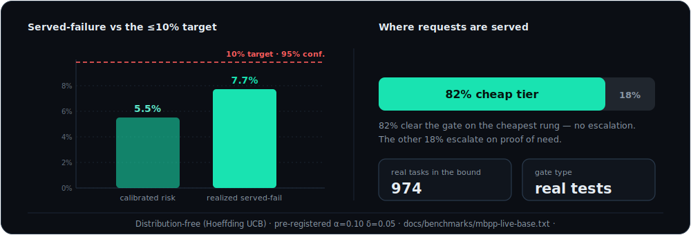
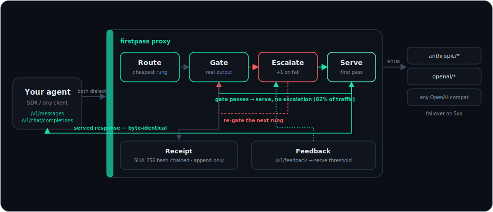
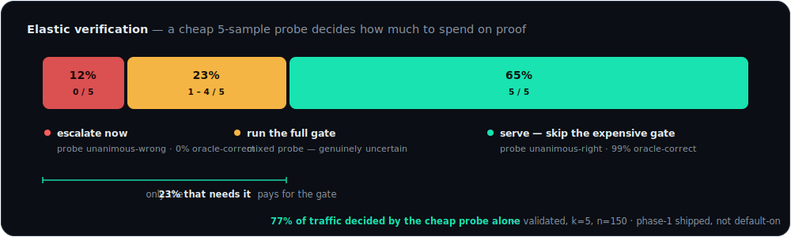

<div align="center">


# ⚡ Firstpass

### The adaptive LLM router that proves the answer instead of guessing the model.

Open every request on the **cheapest** model, **gate the real output** with your own test / schema / judge, escalate **only on proof of need**, and seal a **hash-chained receipt** every time. Wrong answers are capped by a **distribution-free guarantee**, not a promise.

<p>
<a href="https://github.com/dshakes/firstpass/actions/workflows/ci.yml"></a>
<a href="https://github.com/dshakes/firstpass/releases"></a>
<a href="https://pypi.org/project/firstpass/"></a>
<a href="LICENSE"></a>
<a href="https://github.com/dshakes/firstpass/stargazers"></a>
</p>

**[Website](https://dshakes.github.io/firstpass/guide/)** · [Install](#install) · [Quickstart](#quickstart) · [How it works](#how-it-works) · [The proof](#the-proof) · [Docs](https://dshakes.github.io/firstpass/guide/)

</div>

---

## Proof over prediction

Most routers decide by **prediction**: a classifier reads your prompt and *guesses* which model can handle it — before a single token of output exists. Guess wrong and you find out in production, with no artifact explaining why.

Firstpass decides by **proof**. It opens on the cheapest model in your ladder, then **gates the actual output** — runs your tests, checks a schema, asks a judge, or measures self-consistency. Pass → it serves. Fail → it escalates exactly one rung and gates again. The cheap model handles most traffic; the frontier model is spent **only when the cheap one is provably not enough**. Every decision is a tamper-evident, hash-chained receipt you (or an auditor) can re-derive independently — and a **distribution-free bound caps how often a wrong answer is served**.

> **Cheap until proven otherwise.** You pay frontier prices only when a real check proves you must.

---

## How it works

<div align="center"></div>

1. **Route** — every request opens on the cheapest rung of your model ladder. No per-prompt classifier picks the model; the cheap model simply takes the first pass.
2. **Prove** — a *gate* checks the actual output: your unit tests, a JSON schema, an LLM judge (maker ≠ checker), or self-consistency. It reads the real answer, not the prompt.
3. **Escalate** — only on gate failure: one rung up, budget-capped, with cross-provider failover on a 5xx.
4. **Learn** — outcomes feed back via `/v1/feedback`; the serve threshold self-tunes so the guarantee tracks your live traffic. **No policy model to retrain, ever.**

> **Who decides a request needs the expensive model?** The gate — from the cheap model's *actual answer*. Never a classifier guessing from the prompt. Change what "good" means by editing a gate; there's nothing to retrain.

<sub>Live, animated walkthrough → [How it works](https://dshakes.github.io/firstpass/guide/how-it-works.html)</sub>

---

## The proof

The claim no predictive router makes: on **974 real MBPP coding tasks** (fail-closed sandbox, real unit-test gates — [committed artifact](docs/benchmarks/mbpp-live-base.txt)), Firstpass earned a **distribution-free bound of ≤10% wrong answers served at 95% confidence** — calibrated risk **5.5%**, realized served-failure **7.7%** at the threshold — while serving **82%** of requests from the cheap tier.

<div align="center"></div>

The bound is a Hoeffding upper confidence bound — **valid for any data distribution**, no Gaussian assumptions. It's computed from a real run, not assumed. Your savings depend on your workload, which is why every trace records the always-frontier counterfactual: **you measure your number instead of trusting ours.**

<details>
<summary><b>Reproduce it</b> — each command labels itself and states what it costs</summary>

```bash
cargo run -p firstpass-bench                    # simulation harness (free, self-labeled SIMULATION)
cargo run -p firstpass-bench -- --live          # live benchmark (your key, ~a few $)

# the distribution-free bound on 974 real MBPP tasks (your key + Docker, ~$5):
curl -sLO https://raw.githubusercontent.com/google-research/google-research/master/mbpp/mbpp.jsonl
FIRSTPASS_CODING_DATASET=./mbpp.jsonl \
  cargo run --release -p firstpass-bench -- --coding-live
```

The harness recomputes the conformal bound from *your* run's gate/oracle outcomes with the same pre-registered `α=0.10, δ=0.05`. Result artifacts and provenance rules live in [`docs/benchmarks/`](docs/benchmarks/) ([methodology + kill criterion](https://dshakes.github.io/firstpass/guide/guarantee.html)).
</details>

---

## Firstpass vs. predictive routers

| | Predictive routers | ⚡ **Firstpass** |
|---|---|---|
| **Decides by** | guessing from the prompt | **proving the real output** |
| **A wrong answer** | ships silently | **caught by the gate, escalated** |
| **Quality guarantee** | none | **≤10% served-failure @ 95%, earned live** |
| **Adapts by** | retraining a policy model | **self-tuning threshold + edit a gate** |
| **Audit trail** | a dashboard number | **hash-chained receipt per decision** |
| **A policy change** | deploy and hope | **rehearsed first: `firstpass ope` replays your logs with CIs** |

And the one good idea predictive routers had — *starting* on the right model — is already **inside** Firstpass: a learned start-rung bandit picks where the ladder begins, prediction errors cost only latency, and the gate still decides what ships.

---

## The receipt

<details>
<summary><b>🧾 Every decision is a hash-chained trace an auditor can re-derive</b></summary>

```jsonc
{
  "trace_id": "0192f3a1-7c4e-7abc-9d21-4e8b1f0a2c33",
  "prev_hash": "9f2c…a1b7",                          // chains to the prior decision — tamper-evident
  "attempts": [
    { "rung": 0, "model": "anthropic/claude-haiku-4-5", "cost_usd": 0.0007,
      "gates": [{ "gate_id": "cargo-test", "verdict": "fail" }] },   // cheap tried first — gate caught it
    { "rung": 1, "model": "anthropic/claude-sonnet-5", "cost_usd": 0.0121,
      "gates": [{ "gate_id": "cargo-test", "verdict": "pass" }] }    // escalated, proven, served
  ],
  "final": { "served_rung": 1, "total_cost_usd": 0.0128,
             "counterfactual_baseline_usd": 0.0630, "savings_usd": 0.0502 }
}
```

Downstream outcomes flow back via `POST /v1/feedback` onto a deferred-verdict side table that **never alters the sealed record**.

**Independently auditable.** `firstpass export` writes the sealed log as JSONL; anyone — an auditor, a regulator, you — runs `firstpass verify --file receipts.jsonl` on their own machine to re-derive the hash chain from genesis, **no proxy and no database in the loop**. A single altered or reordered receipt breaks the chain at its index and exits non-zero. Black-box routers can't produce this artifact; it's the EU-AI-Act-style logging story, built in.
</details>

---

## Install

No Rust, no toolchain — grab a binary and go:

```bash
curl --proto '=https' --tlsv1.2 -LsSf https://github.com/dshakes/firstpass/releases/latest/download/firstpass-proxy-installer.sh | sh
```

Or through your package manager — each row is live and republishes on every release:

| | |
|---|---|
| 🐍 **pip / uvx** | `pip install firstpass` · `uvx --from firstpass firstpass-proxy` |
| 🍺 **Homebrew** | `brew install dshakes/tap/firstpass-proxy` |
| 🐳 **Docker** | `docker run -p 8080:8080 -e FIRSTPASS_BIND=0.0.0.0:8080 ghcr.io/dshakes/firstpass:latest` |
| 🦀 **Cargo** | `cargo install --git https://github.com/dshakes/firstpass firstpass-proxy` <sub>(needs a Rust toolchain; crates.io publish pending)</sub> |
| ⬇️ **Binaries** | macOS · Linux · Windows, checksummed, self-updating (`firstpass-proxy-update`) — [Releases](https://github.com/dshakes/firstpass/releases) |

## Quickstart

Three lines. Zero config. **Zero risk** — observe mode changes nothing:

```bash
firstpass-proxy                                     # watches your traffic, touches nothing
export ANTHROPIC_BASE_URL="http://127.0.0.1:8080"   # your agent now routes through firstpass
# … use your agent normally — every call gets a receipt: what it'd route, what you'd save
```

Convinced by your own numbers? Switch on routing:

```bash
cp firstpass.example.toml firstpass.toml
FIRSTPASS_MODE=enforce FIRSTPASS_CONFIG=./firstpass.toml firstpass-proxy
```

Leaving is `unset ANTHROPIC_BASE_URL`. That's the whole offboarding story.

### 🤖 …or let an agent do it — one command does everything

Don't follow docs. Firstpass detects your machine, plans the setup, executes it, and verifies itself:

```console
$ firstpass onboard --apply
detected: shell=zsh · proxy_running=false · routed=false · claude_cli=true

✓ proxy started (pid 17005, observe mode) — log: firstpass-proxy.log
✓ wired ~/.zshrc — export ANTHROPIC_BASE_URL=http://127.0.0.1:8080
→ optional: claude mcp add firstpass -- firstpass mcp
✓ verified — proxy healthy · capabilities live
```

Auto-detects your shell (zsh/bash/fish), whether the proxy is running, whether you're already routed, and which agents you have — then does only what's missing. **Idempotent** (re-run any time), **transparent** (`firstpass onboard` alone is a dry run showing the exact plan), and **reversible** (`firstpass offboard` strips the shell line, stops the proxy, prints the unset). For agents onboarding *themselves*: [`llms.txt`](llms.txt) + [`AGENTS.md`](AGENTS.md) ship machine-readable setup, `GET /v1/capabilities` gives runtime discovery, and `firstpass mcp` exposes traces, savings, evals, policy rehearsal, and receipt verification as tools.

---

## Architecture

Firstpass is a proxy in front of your provider calls. Your agent keeps its existing endpoint — Firstpass speaks **both inbound wire dialects** and returns a normal response, byte-identical to the served rung.

<div align="center"></div>

### Every provider, including open-source

A ladder rung is `<id>/<model>` — open on a free local model, escalate to a frontier model only on proven need:

```toml
[[provider]]
id = "groq"                                  # any OpenAI-compatible host — Groq, Together,
dialect = "openai"                           # DeepSeek, Mistral, xAI, Azure, an aggregator,
base_url = "https://api.groq.com/openai"     # or your own Ollama / vLLM box
api_key_env = "GROQ_API_KEY"

[[route]]
match  = {}
mode   = "enforce"
ladder = ["groq/llama-3.3-70b-versatile", "anthropic/claude-sonnet-5"]
gates  = ["unit-tests"]
```

`anthropic` and `openai` are built in; Gemini (`dialect = "gemini"`), AWS Bedrock (`auth = "aws_sigv4"`), and Google Vertex (`auth = "gcp_oauth"`) use the same shape. Every variant ships in [`firstpass.example.toml`](firstpass.example.toml), guarded by a parse test.

> **Verification status, stated plainly.** The Anthropic path is **live-verified end-to-end** (real traffic through the running proxy). The OpenAI-compatible, Gemini, Bedrock, and Vertex adapters are **implemented and offline-tested against recorded wire shapes, pending live verification** — each flips to *verified* when a key-gated CI smoke test exercises it against the real endpoint ([roadmap](docs/roadmap.md), Phase 1).

### Gates — "do I have to write them?"

No. Meet it where you are:

| Effort | You get |
|---|---|
| **None** — observe mode | Firstpass reports what it *would* route and save. Nothing changes. |
| **One sentence** — judge gate | A second model grades every answer against your plain-English rubric. |
| **One config line** — consistency gate | The model answers *k* times; agreement is measured confidence (self-consistency, Wang et al. 2022). |
| **Your existing tests** | The strongest gate: generated code ships only if your suite actually passes. |

Flaky gates auto-disable on an error budget — one bad check can't take down a route.

### Modes

One header, five profiles — set per request via `x-firstpass-mode` (or per route / env): `cost` · `balanced` · `quality` · `latency` · `max`. Same ladder, different serve threshold and escalation appetite: `cost` serves the cheapest thing that clears the gate, `quality`/`max` climb sooner, `latency` prefers the speculative path.

### The science

Firstpass is precise about what's novel versus assembled from known parts (the cascade itself is prior art):

- **Learned start-rung bandit** — deterministic UCB1, or Thompson sampling with discounted Beta posteriors, drift-forgetting, and logged native-MC propensities ([ADR 0007](docs/adr/0007-thompson-start-rung.md)). Predicts where to *start*; the gate still decides what to *serve*.
- **The guarantee** — split-conformal (Hoeffding UCB) or **Learn-then-Test / RCPS** exact-binomial testing (`firstpass calibrate --method ltt`), tracked live under drift by **adaptive conformal** (Gibbs–Candès). Two Prometheus gauges expose the loop: `firstpass_serve_threshold`, `firstpass_realized_served_failure`.
- **Off-policy evaluation** — `firstpass ope` replays your logged receipts against a candidate ladder with IPS / SNIPS / DR estimators and confidence intervals: **rehearse a policy change before you ship it**.
- **Elastic verification** *(validated research, phase-1 shipped, not default-on)* — a cheap *k*-sample probe decides how much proof to spend: unanimous-wrong escalates immediately, unanimous-right serves without the expensive gate, only the uncertain middle pays for it ([ADR 0008](docs/adr/0008-elastic-verification.md)).

<div align="center"></div>

<details>
<summary><b>⚙️ Configuration</b> — 12-factor, env-driven</summary>

| Variable | Purpose | Default |
|---|---|---|
| `FIRSTPASS_MODE` | `observe` \| `enforce` | `observe` |
| `FIRSTPASS_BIND` | listen address | `127.0.0.1:8080` |
| `FIRSTPASS_CONFIG` | path to `firstpass.toml` (routes, ladders, gates, providers) | — |
| `FIRSTPASS_DB` | trace store path | `firstpass.db` |
| `FIRSTPASS_RECEIPTS` | `best_effort` \| `durable` — durable spills receipts to disk under backpressure instead of dropping, and drains them on boot (audit chain stays valid) | `best_effort` |

**Endpoints:** `POST /v1/messages` (Anthropic drop-in) · `POST /v1/chat/completions` (OpenAI drop-in) · `POST /v1/feedback` · `GET /v1/capabilities` · `GET /healthz` · `GET /metrics`.

Multi-tenant deployments add per-tenant auth (Argon2id), rate limits, gate-health scoping, and AES-256-GCM key custody — all opt-in, default-off ([ADR 0004](docs/adr/0004-hosted-multitenant-plane.md)).
</details>

---

## Status

**v0.2.0 — pre-GA, shipped in the open.** Honest about the line between shipped and researched.

| ✅ Shipped & verified | 🔬 Next / research |
|---|---|
| Both wire dialects, structured enforce **default-on** | Elastic verification (validated, phasing in) |
| All five gate kinds + per-gate `on_abstain` | Cross-dialect structured translation beyond Anthropic↔OpenAI |
| Start-rung bandit (UCB1 / Thompson), speculation, failover | Four provider dialects await live wire verification |
| Conformal guarantee + Learn-then-Test | 30-day soak, external security audit |
| Adaptive threshold, OPE, `savings` / `evals` | Hosted multi-tenant plane |
| Receipts + export/verify + durable mode | crates.io publish |
| Modes, per-deployment `[[price]]`, Grafana dashboard, nightly provider-smoke CI | |

GA is a checklist we publish ([ADR 0003](docs/adr/0003-production-ga-readiness.md)), not an adjective — the exact remaining items (secrets, soak clock, external audit) are enumerated in the [GA handoff](docs/ga-handoff.md).

---

## Links

[Docs](https://dshakes.github.io/firstpass/guide/) · [How it works](https://dshakes.github.io/firstpass/guide/how-it-works.html) · [The guarantee](https://dshakes.github.io/firstpass/guide/guarantee.html) · [SPEC](SPEC.md) · [Example config](firstpass.example.toml) · [ADRs](docs/adr) · [Agent guide](AGENTS.md) · [llms.txt](llms.txt) · [License](LICENSE)

<div align="center">

**Try cheap. Prove it. Escalate only on failure.**

<sub>proof over prediction · receipts over adjectives</sub>

</div>
